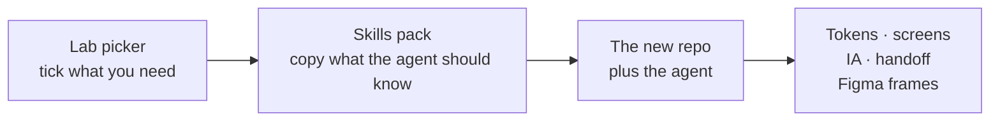
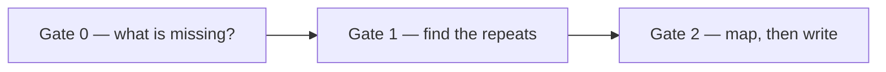

```
      ██╗   ██╗██╗  ██╗███████╗ ██████╗ ██╗     ██████╗
      ██║   ██║╚██╗██╔╝██╔════╝██╔═══██╗██║     ██╔══██╗
      ██║   ██║ ╚███╔╝ █████╗  ██║   ██║██║     ██║  ██║
      ██║   ██║ ██╔██╗ ██╔══╝  ██║   ██║██║     ██║  ██║
      ╚██████╔╝██╔╝ ██╗██║     ╚██████╔╝███████╗██████╔╝
       ╚═════╝ ╚═╝  ╚═╝╚═╝      ╚═════╝ ╚══════╝╚═════╝

                    S  K  I  L  L  S

           code is the design file
           one AGENTS.md  ·  any agent
```

# UxFold Skills

The instruction pack a new [UxFold Lab](https://github.com/uxfold/UxFold-Lab) project starts with.

This repo is **not** a design tool and **not** an app. It is the set of files Lab copies into a project so the coding agent already knows how you design — before anyone types a prompt.

It works with whatever agent the designer already pays for: Claude Code, Codex, OpenCode, Cursor, Gemini CLI, Grok, Copilot, or anything else that can load a `SKILL.md`. Rules are written as “the agent”, never as one vendor.



---

## Why this exists

A coding agent is smart and forgetful. Every new chat it starts from zero, unless you leave instructions in the repo.

Without this pack, a designer opening Lab has to re-explain:

- use tokens, not random hex
- reuse the button we already have
- do not invent twelve widgets for a “dashboard”
- write the sitemap down, not only in chat
- if we push to Figma, ask about components first

With this pack, that speech happens once. New Project ticks the skills. Create copies them. The next agent session already has the house rules.

Two kinds of knowledge live in different places on purpose:

| Kind | Where it lives | Why |
| --- | --- | --- |
| Facts that are always true | `templates/AGENTS.md` | Loaded every session. Keep it short. |
| A procedure used sometimes | a `SKILL.md` folder | Loaded only when the ask matches. Saves tokens. |

`templates/CLAUDE.md` is one line: read `AGENTS.md`. Claude Code looks for `CLAUDE.md`. Codex and others look for `AGENTS.md`. Same rules, two filenames.

---

## What you tick in New Project

`skills-catalogue.json` is the list Lab’s picker reads. Each row is a name, one line of copy, a repo, an install command, and on or off.

**On by default** — every new project gets these unless you untick them:

- `uxfold-core`
- `uxfold-principles`
- `uxfold-handoff`
- Superpowers (Claude Code plugin)
- claude-mem (Claude Code plugin)

**Off until you tick them** — still in the list, not forced:

- House: IA, funnel, MoSCoW, Figma push, ux-modules
- Community: Anthropic frontend-design, Taste, Vercel guidelines, UX writing, ux-designer, ponytail, image-to-code, Playwright CLI, Obsidian

House skills are copied from this repo. Community skills stay on GitHub; Lab only runs their install command if you ticked them.

---

## House skills, one by one

### `uxfold-core` — the floor

**When it fires:** starting work, editing UI, talking about tokens, Tune, components, or the preview.

**What goes wrong without it:** the agent adds a new hex, a new radius, and a second button component. The preview breaks and it still says “done”.

**What it does:**

1. Read `AGENTS.md` first.
2. Find the tokens file. Prefer CSS variables over one-off values.
3. Reuse a component that already exists.
4. If an element is selected in Lab, change that element unless you said “everywhere”.
5. After the edit, the preview must still compile.

**How it helps you:** Tune and the agent stay on the same system. You are not cleaning leftover colours out of ten files.

Default: **on**.

---

### `uxfold-principles` — how we decide what “good” is

**When it fires:** new screen, redesign, critique, “does this feel finished?”, “is this too much?”, patterns, scale.

This is the design brain. It runs tests, not essays.

**1. Aesthetic-usability**  
People trust a screen that looks finished. Mixed radii, leftover placeholder copy, or a table with no empty state fail this test. Fix the system first.

**2. Pareto**  
Name the one or two jobs that carry most of the value. Build those. Everything else goes through MoSCoW.

**3. Heuristics**  
A scored pass against Nielsen’s ten — status visible, user control, consistency, error prevention, and the rest. Output is a table: severity, where, fix. Not a lecture. Detail lives in `references/heuristics.md`.

**4. Parkinson**  
If you ask for “a dashboard”, the agent proposes one primary action and one list — not twelve widgets to look busy.

**5. Pattern catalogues**  
Enterprise vs consumer are different products. Tables, bulk actions, and explicit save sit in one catalogue. One CTA, skippable onboarding, and a friendly empty state sit in the other. The agent picks from `AGENTS.md`. See `references/pattern-catalogues.md`.

**6. Desirability, feasibility, scalability**  
Three lines on any real feature: whose job is this, do we already have the component and the data, what breaks at 10× rows or a second language.

**How it helps you:** the agent stops decorating and starts choosing. You get a smaller, more believable slice.

Default: **on**.

---

### `uxfold-ia` — the map of the product

**When it fires:** new app, new area, sitemap, user flows, “draw the architecture”.

Chat maps disappear. This skill writes files:

- `docs/ia.md` — Mermaid sitemap plus a table of screens, jobs, and entry points
- `docs/ia.drawio` — the same map in Draw.io, so you can open it in diagrams.net or the VS Code extension

One node per route or distinct screen, not per component. Group by the user’s job, not by the current nav label. Mark the primary path.

**How it helps you:** you can point at a file and say “this is the product”, instead of re-explaining the sitemap every session. Engineering gets the same map.

Default: **off**. Tick it when you are shaping a product, not when you are polishing one screen.

---

### `uxfold-funnel` — why each screen exists in the journey

**When it fires:** marketing site, onboarding, growth, conversion, pricing, paywall, first-run.

Every screen gets a label:

| Stage | Job |
| --- | --- |
| TOFU | Understand and trust. What is this, why care. |
| MOFU | Evaluate. Compare, preview, proof, FAQ. |
| BOFU | Act. Sign up, pay, invite, first success. |

Logged-in products use the same idea as acquire → activate → habitual job. An admin tool is not turned into a landing page.

Writes `docs/funnel.md`. One primary action at the bottom of the funnel. Payment and permissions wait until the user has seen value, unless the product is paid-only.

**How it helps you:** growth screens stop competing with each other. You can see which view is asking for trust and which view is asking for a card.

Default: **off**.

---

### `uxfold-moscow` — what this slice will not do

**When it fires:** MVP, roadmap, “what do we build first”, scope cuts.

Four buckets, each with a reason:

- **Must** — the slice fails without this
- **Should** — important, the slice still works if it slips
- **Could** — nice if cheap
- **Will not (this slice)** — parked on purpose

Writes `docs/scope.md`. A long Must list is a failed slice. Will-not is a decision, not a junk drawer.

**How it helps you:** the agent cannot keep adding “while we’re here” features. You have a page to point at when scope creeps.

Default: **off**.

---

### `uxfold-handoff` — what engineering actually needs

**When it fires:** “handoff”, “visual explainer”, “write the PR”, “give this to engineering”.

Writes `docs/handoff.md`:

- intent
- files and tokens that changed
- components reused vs new
- states designed (default, hover, disabled, loading, empty, error)
- assumptions and out of scope
- how to run, how to verify

If Playwright CLI is installed, it snapshots the changed routes. If not, it says screenshots were skipped.

It will not invent a backend the prototype does not have. It will not say “make it pixel perfect” without paths.

**How it helps you:** the PR is the prototype plus a note, not a Figma page full of redlines the code already disagrees with.

Default: **on**.

---

### `uxfold-figma-push` — screens onto the canvas, on purpose

**When it fires:** “push this screen to Figma”, “sync this flow”, “make a Figma file from this project”.

This skill is the interviewer. Official Figma skills (`figma-use`, `figma-generate-design`, `figma-generate-library`, `figma-code-connect`, `figma-create-new-file`) move pixels. If Figma is not connected, it prints the connect steps and stops. It does not fake a `.fig` file.



**Gate 0 — ask only what you did not already say**

| Mode | Meaning |
| --- | --- |
| A | Frames only. One frame per route and state. Fast. No components. |
| B | Create new local components in this file, then instance the rest. |
| C | Use a **published** team library and Code Connect when it exists. |
| D | Reuse components that **already live in this Figma file**, even if they were never published. |

D is the usual case. Unpublished local components are still a system for that file. Search the file first. Only create something new when nothing in the file is close enough.

Also asked if missing: file URL or new file, breakpoints, which screens, naming.

**Gate 1 — repeat detection**

Ten identical buttons across thirty screens are one component. A card mapped over a list is one component — and the agent must ask “this row only, or all of them?”. Two files that only look the same are not merged in silence.

**Gate 2 — mapping**

| Code | Figma | Action |
| --- | --- | --- |
| Exact Code Connect match | that component | instance it, never redraw |
| Same name in the file (D) | local component | instance it |
| Published library match (C) | library component | instance it |
| Close but not equal | — | stop and tell you |
| No match | — | mode B, tag `UNMAPPED` |

On a mismatch you get three choices: accept the drift, make a local variant named after this project, or leave a raw frame. The agent must not “almost” swap a primary button.

Write rules: instances over rectangles, variables over raw hex, auto layout, one frame = one route + one breakpoint + one state. Do not publish to the team library unless you said publish.

**How it helps you:** Figma becomes a picture of the live product, not a second source of truth that drifts. Stakeholders who still live in Figma get frames. You keep designing in code.

Default: **off**. Needs a Figma connection in the agent.

---

### `uxfold-ux-modules` — do not load all 24 UX topics

**When it fires:** you ticked the community `ux-designer` skill and then picked topics.

[szilu/ux-designer-skill](https://github.com/szilu/ux-designer-skill) is large on purpose — forms, tables, canvas, voice, a11y, research, and more. Loading every file wastes context.

This house skill reads `docs/ux-modules.json` and only opens the matching reference files. The picker list is `ux-designer-modules.json` in this repo.

Suggested on: foundations (principles, laws, a11y, visual) and structure (IA, interaction, forms).  
Suggested off until you need them: mobile, research, collaboration, canvas, AI UI, ethics, onboarding, notifications, search, charts, tables, i18n, voice.

**How it helps you:** you get a serious UX reviewer for the topics you care about, without stuffing the agent with canvas-performance notes on a marketing page.

Default: **off**. Pair it with the `ux-designer` tick.

---

## Community skills, and why they are on the list

These are other people’s work. Lab installs them when ticked. We do not copy their code into this repo.

| Tick | What it is for | Why it is here |
| --- | --- | --- |
| `frontend-design` | Anthropic’s anti-slop frontend skill | Stops the default Inter + purple-gradient look. Off by default so you choose it. |
| `design-taste-frontend` | Taste-skill art direction | Variance, motion, density. Complements principles; does not replace them. |
| `web-design-guidelines` | Vercel UI audit | Accessibility, focus, forms, motion. A reviewer, not a generator. |
| `writing-guidelines` | Vercel prose audit | Docs and marketing voice. Different from UI microcopy. |
| `ux-writing` | Buttons, errors, empty states | The dedicated microcopy skill. |
| `ux-designer` | Broad UX reference set | Use with `uxfold-ux-modules` so you pick topics. |
| `ponytail` | Do less | Native date input before a date-picker library. Pairs with core and Parkinson. |
| `image-to-code` | Screenshot to code | When you drop a Mobbin or Figma export and want a matching screen. |
| `playwright-cli` | Browser QA for agents | Snapshots after an edit. Handoff uses it if present. |
| `superpowers` | Method: plan, test, verify | Claude Code plugin. Default on for that agent. |
| `claude-mem` | Remember past sessions | Claude Code plugin. Default on for that agent. Other agents skip it. |
| `obsidian-skills` | Specs in an Obsidian vault | Off. Only if that is how you keep notes. |

If a tick needs a tool the current agent does not have, the house skills say so and continue with the parts they can do.

---

## What lands in the new project

```
your-project/
  AGENTS.md              facts for every agent
  CLAUDE.md              read AGENTS.md
  DESIGN.md              optional style sheet
  docs/
    ia.md                if IA was ticked
    ia.drawio
    funnel.md            if funnel was ticked
    scope.md             if MoSCoW was ticked
    handoff.md           when you ask for handoff
    ux-modules.json      if ux-designer topics were picked
  .agents/skills/        Codex, OpenCode, and others
  .claude/skills/        Claude Code — same files
```

Each ticked house skill is copied into **both** skill folders. Same instructions, two discovery paths.

Do not overwrite an `AGENTS.md` the designer already wrote.

---

## How Lab should use this repo

Full copy map: `HOW-TO-USE.md`.

1. Point the New Project picker at `skills-catalogue.json`.
2. Copy `templates/AGENTS.md` and `templates/CLAUDE.md` into every scaffolded repo. Fill framework, UI library, tokens path, preview command.
3. Copy each ticked `skills/uxfold-*` folder into `.agents/skills` and `.claude/skills`.
4. Run the catalogue install line only for community skills that were ticked.
5. If `ux-designer` was ticked, write `docs/ux-modules.json` from the module picker.

That wiring lives in UxFold Lab, not in this repo.

---

## What this pack will not do

- It will not drag or resize elements. That stays out of Lab’s free core.
- It will not become a Figma editor. It only pushes screens when you ask.
- It will not hold API keys or run its own model. You bring the agent.
- It will not replace Tune. Token sliders stay instant and local.

---

MIT. Built for [UxFold Lab](https://github.com/uxfold/UxFold-Lab).
