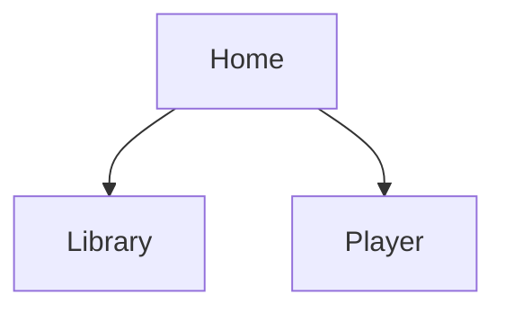

# Information architecture

Write files into the repo. Chat-only maps get lost.

## Outputs

Create or update both of these:

1. `docs/ia.md` — sitemap in Mermaid plus a table of screens
2. `docs/ia.drawio` — Draw.io XML the designer can open in diagrams.net or the VS Code Draw.io extension

If you cannot write `.drawio` reliably, write the Mermaid in `docs/ia.md` and say the Draw.io file was skipped.

## Rules

- One node per route or distinct screen, not per component.
- Group by user job, not by the current nav label.
- Mark the primary path.
- Name entry points (first open, deep link, empty state CTA, notification).
- Keep labels the user would say, not file names.

## `docs/ia.md` shape

```md
# Information architecture

## Sitemap



## Screens

| Screen | Job | Entry points | Notes |
| --- | --- | --- | --- |
```

## `docs/ia.drawio` shape

Use a simple flowchart. One box per screen. Edges are user movement. Put the file at `docs/ia.drawio` so it versions with the project.

```xml
<mxfile host="app.diagrams.net">
  <diagram name="IA" id="ia">
    <mxGraphModel dx="800" dy="600" grid="1" gridSize="10">
      <root>
        <mxCell id="0"/>
        <mxCell id="1" parent="0"/>
      </root>
    </mxGraphModel>
  </diagram>
</mxfile>
```

Fill real cells. Do not leave the stub empty if you claimed the file was written.
